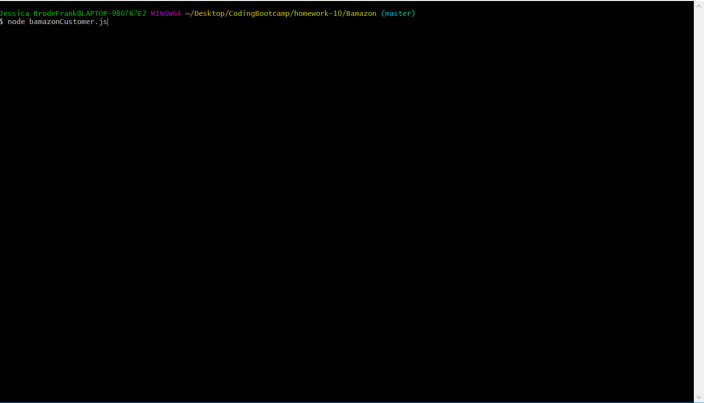
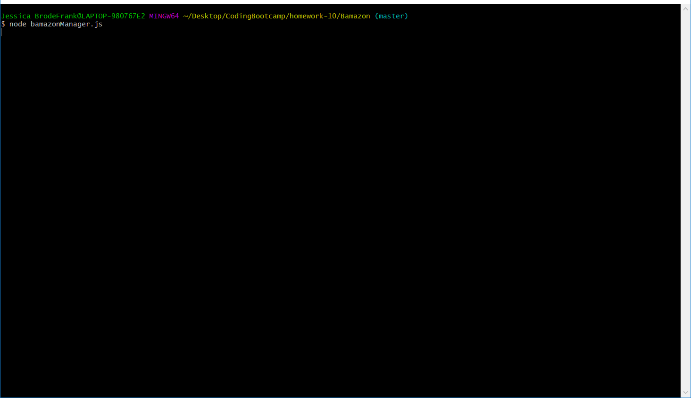

# Bamazon
Bamazon is an interactive program for buying, stocking, and keeping track of store inventory. It is meant to be used by three seperate user types: customers, managers, and supervisors. Each program of the corrosponding name will perform different tasks according to what that user might need. Product inventory, prices, and sales totals are kept track of in the 'products' table the bamazon.sql bamazon database. Department name's, id's, and overhead costs are kept in the same database under the 'departments' table. 

The three programs and their functionalities are listed below.

1. Customer (bamazonCustomer.js)
Customers have a varity of options when they use the bamazon app.
    -Product List: View the products that are currently offered and their prices.
    -Product Purchase: Add a product to their cart at the desired quantity
    -Cart List: View the current products in their cart with the products' prices and quantities, along with the cart's total price.
    -Checkout: Buys all the items in the cart at the selected quantities. If a customer buys more of an item than is currently stocked they will instead buy out the remaining inventory of that item.

2. Manager (bamazonManager.js)
Managers have their own options to use when they use the Manager app.
    -Products for Sale: View the products that are currently offered and their prices.
    -View Low Inventory: View all the products that have less than 10 items left in stock.
    -Add to Inventory: Increase the items in stock of a product.
    -Add New Product: Add a new item to product table of the database.

3. Supervisor (bamazonSupervisor.js)
Supervisors have their own options to use when they use the Supervisor app.
    -Product List: View the products that are currently offered and their prices.
    -Product Sales by Department: View the departments sales, overhead, and total profit.
    -Create New Department: Create a new department in the department table of the database.

Every input from all three of the programs is sanitized to decrease errors in data and the program.

Make sure to have all npm dependencies installed before running the app.
Dependencies include: 
    -inquirer 
    -mysql 
    -console.table
